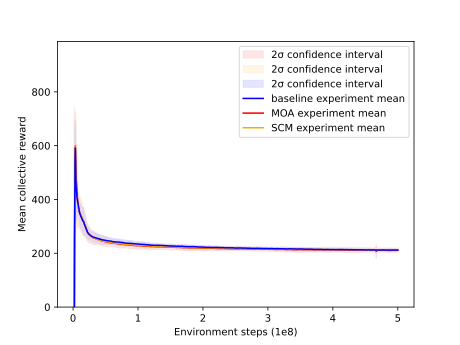

The implemented environments are structured to be compatible with [OpenAIs gym environments](https://github.com/openai/gym) as well as [RLlib's Multiagent Environment](https://github.com/ray-project/ray/blob/master/rllib/env/multi_agent_env.py)

## Implemented Games

* **Cleanup**: A public goods dilemma in which agents get a reward for consuming apples, but must use a cleaning beam to clean a river in order for apples to grow. While an agent is cleaning the river, other agents can exploit it by consuming the apples that appear.

* **Harvest**: A tragedy-of-the-commons dilemma in which apples regrow at a rate that depends on the amount of nearby apples. If individual agents employ an exploitative strategy by greedily consuming too many apples, the collective reward of all agents is reduced.

These diagrams show the payoff that an individual agent can expect if it follows a defecting/exploitative strategy (red) vs a cooperative strategy (blue), given the number of other agents that are cooperating.  We can see that an individual agent can almost always greedily benefit from detecting, but the more agents that defect, the worse the outcomes for all agents. 

# Tests
Tests are located in the test folder and can be run individually or run by running `python -m pytest`. Many of the less obviously defined rules for the games can be understood by reading the tests, each of which outline some aspect of the game. 
## PPO Results

**Collective cleanup reward**:

**Collective harvest reward**:

